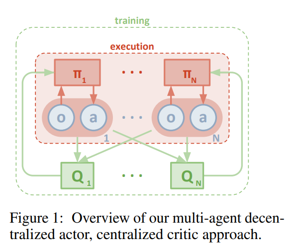
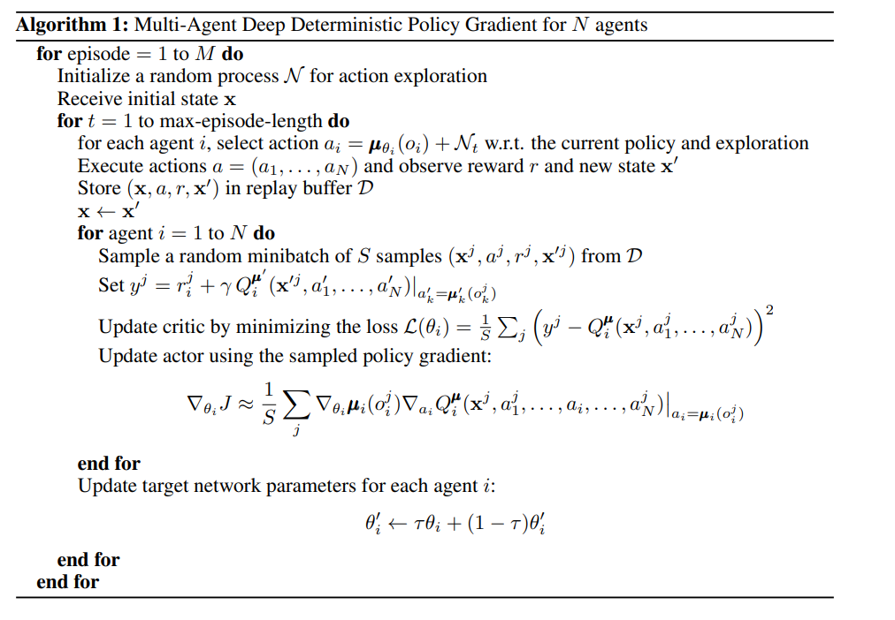
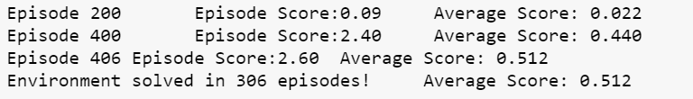
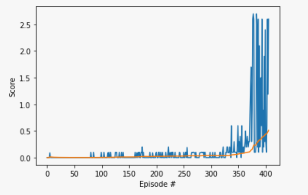
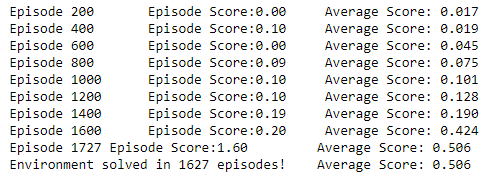
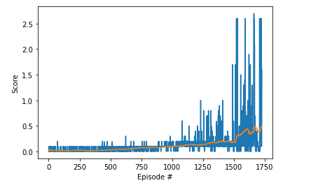
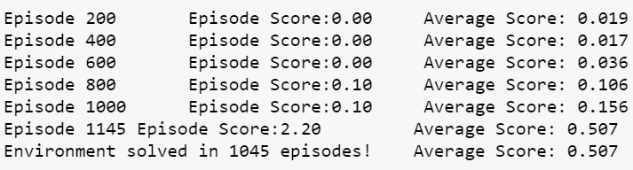
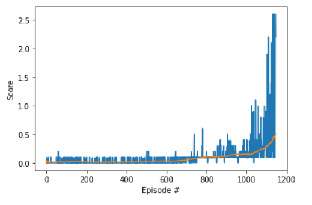
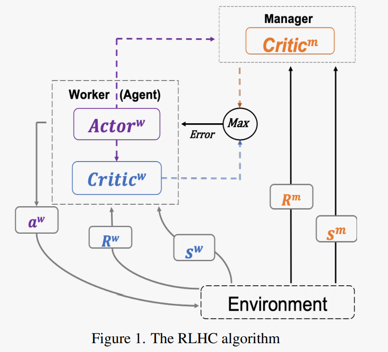

# Multi-Agent Deep Deterministic Policy Gradient (MADDPG) -Tennis
### Overview

This project was developed as part of Udacity Deep Reinforcement Learning Nanodegree course. This project solves Tennis environment by training the agent to using Multi-Agent Deep Deterministic Policy Gradient (MADDPG) algorithm. The environment is based on [Unity ML agents](https://github.com/Unity-Technologies/ml-agents). In this environment, two agents bounce a ball with the help of actions taken on the rackets. If an agent hits the ball, it receives a reward of +0.1. If agent does not hit the ball, it receives a reward of -0.01. The environment is considered solved if the agent can keep the ball in play and scores a reward of +0.5. 

### Introduction

For this project, the unity ML [Tennis](https://github.com/Unity-Technologies/ml-agents/blob/master/docs/Learning-Environment-Examples.md#tennis) environment is used . The agent is trained to play [Tennis](https://github.com/Unity-Technologies/ml-agents/blob/master/docs/Learning-Environment-Examples.md#tennis) 

[Unity ML-Agents Tennis Environment](https://classroom.udacity.com/nanodegrees/nd893-ent/parts/0ba70f95-986b-400c-9b2e-59366cca2a49/modules/83e3a45a-a815-4dca-82bc-c6f1b46ac8cd/lessons/c03538e3-4024-41c5-9baa-3be2d91f250c/concepts/da65c741-cdeb-4f34-bb56-d8977385596e#)

In this environment, two agents control rackets to bounce a ball over a net. If an agent hits the ball over the net, it receives a reward of +0.1. If an agent lets a ball hit the ground or hits the ball out of bounds, it receives a reward of -0.01. Thus, the goal of each agent is to keep the ball in play.

The observation space consists of 8 variables corresponding to the position and velocity of the ball and racket. Each agent receives its own, local observation. Two continuous actions are available, corresponding to movement toward (or away from) the net, and jumping.

The task is episodic, and in order to solve the environment, your agents must get an average score of +0.5 (over 100 consecutive episodes, after taking the maximum over both agents). Specifically,

- After each episode, we add up the rewards that each agent received (without discounting), to get a score for each agent. This yields 2 (potentially different) scores. We then take the maximum of these 2 scores.
- This yields a single **score** for each episode.

The environment is considered solved, when the average (over 100 episodes) of those **scores** is at least +0.5.

### Multi Agent Deep Deterministic Policy Gradient Algorithm

Please refer to https://arxiv.org/pdf/1706.02275.pdf for understanding of Multi-Agent Deep Deterministic Policy Gradient Algorithm. 

MADDPG is a model free off-policy actor-critic multi-agent algorithm that learns directly from observation spaces. Agent trains itself using the local observation and decides the next best course of action, while critic evaluates the quality of the action by looking at all the observations and actions taken by other agents.

The major benefit of MADDPG over DDPG is that it solves non-stationary environment problem that arises in multi-agent algorithms by using centralized critic and decentralized actor approach. Refer to the diagram below.

Source: https://arxiv.org/pdf/1706.02275.pdf

The algorithm is listed below:

### Repository

The repository contains the below files:

- final_maddpg_xreplay.ipynb :  Implementation of MADDPG with experienced replay buffer. Training the  agent is implemented here.

- checkpoint_actor1_xreplay.pth : Learned model weights for Agent 1

- checkpoint_actor2_xreplay.pth : Learned model weights for Agent 2 

- checkpoint_critic1_xreplay.pth : Learned model weights for Critic 1

- checkpoint_critic2_xreplay.pth : Learned model weights for Critic 2

- images  directory: contains images used in documentation

- models directory : Contains other working models and work in progress environments used to solve the Tennis environment  

  Before running the ipynb file,Please copy Tennis environment  to this location or modify the filepath in final_maddpg_xreplay.ipynb to point to the correct location.

## Model Architecture:

Pendulum-v0 environment with [Deep Deterministic Policy Gradients (DDPG)](https://github.com/udacity/deep-reinforcement-learning/blob/master/ddpg-pendulum/DDPG.ipynb) is used as reference  to build the model.  The model architecture that is used is:

Actor:
	Input(state size of 24) &rarr; Dense Layer(64) &rarr; RELU &rarr; Dense Layer(64) &rarr; RELU &rarr; Dense Layer( action size of 2) &rarr; TANH

Critic:
	Input(state size of 48) &rarr; Dense Layer(64) &rarr; LeakyRELU & actions (4) &rarr; Dense Layer(64) &rarr; Leaky RELU &rarr;  Q value

Agent:
	Actor Local and Critic Local networks are trained and updates the Actor Target and Critic Target networks using weighting factor Tau.

### Approach 1:

I started with DDPG pendulum as reference with two agents to train the Tennis environment. The model architecture consisted of 2 agents / 2 critics sharing the same experience replay buffer. The experience replay buffer contained the experiences of all the agents. The agents and critics are trained using all the experiences. The model for Actor and Critic consisted input size of 24 and two hidden units with  512  and 256 units that resulted in action size of 4.  The environment was solved in 306 episodes.

The above approach worked well because of symmetry and correlation of states/actions of both agents. However, I am positive that the above approach won't extend well in multi-agent scenario such as soccer. I decided to improvise it.

### Approach 2:

To improvise the above model, I choose a variant of DDPG. The model consisted of two agents/critic model with their own experience replay buffer. The experience replay buffer is populated with combined experiences of both agents. 

For example, when agent 1 and agent 2 interacted with the environment that resulted in (s1,a1,r1,s1next,done1) and (s2,a2,r2,s2next,done2) then agent 1's experience replay buffer is populated with (s1,s2,a1,a2,r1,s1next,s2next,done1) and agent 2's experience replay buffer is populated with (s1,s2,a1,a2,r2,s1next,s2next,done2). Agent is trained with combined states and Critic is trained with both combined states and combined actions.

Using the above model, the environment was solved in 1627 episodes. The hyperparameters used are listed below in the hyper parameters section.

This model will not generalize well as the agent is making decisions based on not only its state but also state from the other agents. Hence, I decided to implement MADDPG to solve the above environment.

### Approach 3: (MADDPG)

To improvise approach 2, I implemented MADDPG where agent learns the policy by only looking into its state and determines next action. In MADDPG, agent is trained using his own observations while critic is trained using all the observations and actions from all the agents. As the actor is only dependent on his own observation, the approach is extensible and can work in any multi-agent scenario. The model architecture is described in the model architecture section and the hyper parameters used are listed in the hyper parameters and tuning section.

Using the above model, the environment was solved in 1045 episodes. This is a significant improvement over Approach 2.

### Hyperparameters and Tuning:

BUFFER_SIZE = int(1e6)  : replay buffer size
BATCH_SIZE = 512        :minibatch size
GAMMA = 0.95            : discount factor
TAU = 0.05              : for soft update of target parameters
LR_ACTOR = 1e-3         : learning rate of the actor 
LR_CRITIC = 1e-3        : learning rate of the critic
WEIGHT_DECAY = 0        : L2 weight decay
UPDATE_EVERY = 1

The major problem encountered during training is exploration vs exploitation problem. when I am exploiting, I was hitting local minima soon with little exploration. I am going with exploration, I am not able to train the agent efficiently. 

Hyperparameters and tuning played a major role as agent was getting struck in local minima. I started off with neural network with (512,256) , (256,128), (128,64) ,(256,256),(128,128) and finally got better results with (64,64) nodes. I started tuning the hyper parameters based on the values recommended in the experimental results in the paper. I changed TAU from 0.001 to 0.01 and increased to 0.05. 

For the buffer size, I started with 1e5 and soon realized that that buffer is not giving the diversity of experiences and is getting struck in local minima soon. I increased it to 1e6 and it increased in better learning. I tried to apply learn every 20 steps and update 15 steps. However, the learning rate got even slower and did not see significant improvement in performance.

For learning rate, I started with learning rate 1e-3 for actor  and 1e-4 for critic. I noticed that speed of learning is really slow and also getting struck in local minima. I realized tuning noise is one way to come out of saddle point and started tuning the OU noise. Still the agent was hitting the saddle points. So, I added standardized decay to OU noise till 1200 steps. This improved the training of the agent to some extent. To get out of saddle points, I tried to explore with epsilon greedy algorithm and decided to  use random exploration for 500 episodes and applied standardized decay of OU noise till 1200 episodes. This resulted in better performance in training. 

 

### Ideas for Future Work:

In terms of future work, I would tune the MADDPG with Prioritized Experience Replay. I have a version of Prioritized Experience replay in progress that solved environment in 2750 episodes. This model is available in the models folder in the repository. I would consider adding diversity to the experience pool faster to speed up learning. 

The other algorithms that I would like to try are Multi Agent Proximal Policy Optimization (MAPPO) to avoid getting struck in saddle points and RHLC (Reinforcement Learning from Hierarchical Critics ref: https://arxiv.org/pdf/1902.03079.pdf) algorithm . RHLC is believed to speed up learning and each agent not only receives from local critic but also from global critic.  

source:https://arxiv.org/pdf/1902.03079.pdf

## Results:

Agent trained with MA-DDPG  with experience replay solved the environment in 1045 episodes.

##### MADDPG with  Experience Replay

